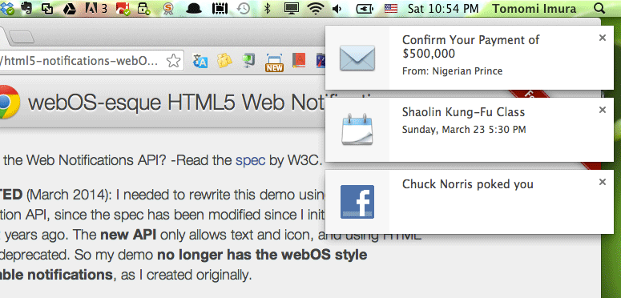

# Web Notifications Demo v2

W3C Web Notifications API demo in webOS UI style.

In the original demo, I implemented the notifications with webOS style, which allowed a user to swipe to close the window. However, this v2 demo no longer supports the swipable notifications because the simplified new Web Notifications spcification only allows text and icon, and external HTML files are no longer permitted.

## Supported Browsers

- Firefox 22+
- Chrome 32+

## Demo

[girliemac.github.com/html5-notifications-webOS-style](http://girliemac.github.com/html5-notifications-webOS-style)

## History

- v.2 (March 2014) - using the [new Web Notification API specs](http://www.w3.org/TR/notifications)
- v.1 (March 2012) - using the old Web Notification API specs, which is now deprecated.

For detailed changelog, check [Releases](https://github.com/webcomponents/element-boilerplate/releases).

## Known Problems

- On Chrome 33, `close()` method does not seem to work. Notification windows fails to close automatically. 
